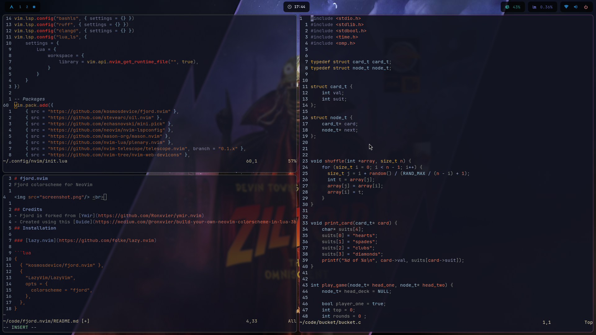

# fjord.nvim
Fjord colorscheme for NeoVim

 <br>

## Credits
- Fjord is forked from [Ymir](https://github.com/Ronxvier/ymir.nvim)
- Created using this [Guide](https://medium.com/@ronxvier/build-your-own-neovim-colorscheme-in-lua-3b01adf019e0)
## Installation

### [lazy.nvim](https://github.com/folke/lazy.nvim)

```lua
{
  { "kosmosdevice/fjord.nvim" },
  {
    "LazyVim/LazyVim",
    opts = {
      colorscheme = "fjord",
    },
  },
}
